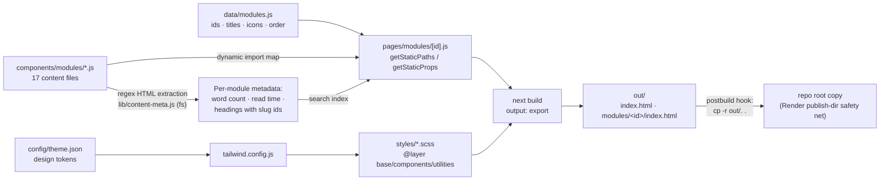
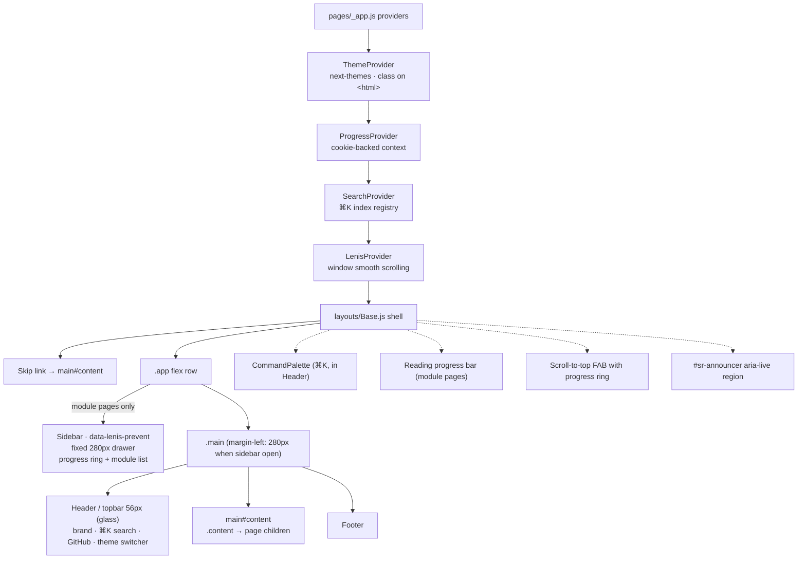

# Architecture

The site has **no server**. Every page prerenders to plain HTML at build time; interactivity is client-side React hydrating on top of that HTML.

## Build-Time Pipeline

Key ideas:

- `data/modules.js` is the single source of truth. The SSG loop enumerates it to generate one HTML file per module, and each module's JSX body is code-split through a dynamic-import map.
- **`lib/content-meta.js`** (Node `fs`, import only from `getStaticProps`) regex-extracts each module's `dangerouslySetInnerHTML` blob and computes reading time plus an ordered heading list. Heading ids come from `lib/slugify.js` — the same pure module the runtime DOM pass uses, so ⌘K section links always resolve.
- Every page's `getStaticProps` also returns the flattened **search index**; pages register it via `useRegisterSearchIndex` (`components/SearchContext.js`) and the ⌘K palette reads it from context. No fetching, works in dev.

## Runtime Layout Shell

Every page renders inside `layouts/Base.js`:

### Scrolling model (important)

The **window is the scroll container** (the topbar is `position: sticky`; `#content` is not independently scrollable). Consequences:

- FAB visibility and the reading-progress bar listen to `window.scroll` events.
- Anchor jumps must use `lib/scroll.js` (`scrollToTarget` / `scrollToTopOfPage`), which route through `lenis.scrollTo()` and fall back to `window.scrollTo`. Base attaches one delegated `click` handler for all `a[href^="#"]` (skip link, palette section links).
- Fixed scrollers inside the page (sidebar nav, command-palette results) carry `data-lenis-prevent` so wheel scrolling inside them doesn't move the page.

### Module page runtime DOM pass

After a module mounts, one idempotent pass over `.module-content` (`pages/modules/[id].js`):

1. assigns anchor ids to `h3`s from the build-time heading list,
2. wraps tables in `.table-wrap`,
3. wraps the "Summary" `h3` + followers into `.summary-section`,
4. rebuilds the terminal-window dots (the source HTML's self-closing ``s nest under HTML parsing) and **injects a copy button** into every `.code-block__header`,
5. honors a `#hash` deep link.

The pass verifies its own work and re-applies (bounded retries) if the DOM gets re-created.

## Technology Choices

| Choice | Rationale |
|--------|-----------|
| Next.js Pages Router | Simple SSG with `getStaticPaths`/`getStaticProps`; App Router adds nothing for a pure-static site |
| `output: "export"` | Produces host-agnostic static files (`out/`) — deployable anywhere |
| Tailwind + SCSS partials | Utility classes for one-off layout; structured BEM-style SCSS for components |
| next-themes (`class` strategy) | Blocking inline script prevents flash-of-wrong-theme; CSS drives icon states |
| Cookie | Module-completion progress in a cookie — purely local, functional storage |
| Lenis (window mode) | Smooth wheel scrolling; `data-lenis-prevent` for nested scrollers; all programmatic scrolls via `lenis.scrollTo` |
| canvas-confetti | ~6 KB; fires on module completion and the 17/17 milestone; skipped under reduced motion |

## Where Things Live

See the annotated directory map in [`AGENTS.md`](../AGENTS.md#directory-map).
