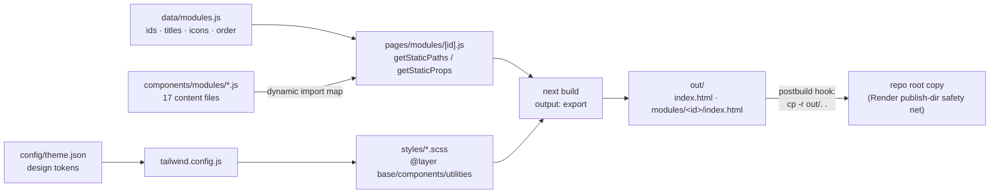
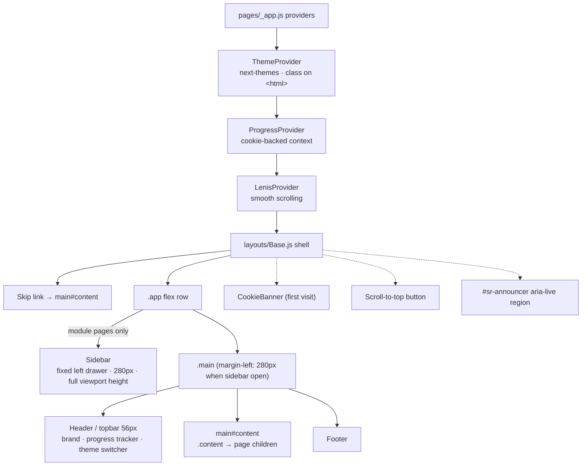

# Architecture

The site has **no server**. Every page prerenders to plain HTML at build time; interactivity is client-side React hydrating on top of that HTML.

## Build-Time Pipeline

Key idea: `data/modules.js` is the single source of truth. The SSG loop enumerates it to generate one HTML file per module, and each module's JSX body is code-split through a dynamic-import map so visitors only download the page they open.

## Runtime Layout Shell

Every page renders inside `layouts/Base.js`:

## Technology Choices

| Choice | Rationale |
|--------|-----------|
| Next.js Pages Router | Simple SSG with `getStaticPaths`/`getStaticProps`; App Router adds nothing for a pure-static site |
| `output: "export"` | Produces host-agnostic static files (`out/`) — deployable anywhere |
| Tailwind + SCSS partials | Utility classes for one-off layout; structured BEM-style SCSS for components |
| next-themes (`class` strategy) | Blocking inline script prevents flash-of-wrong-theme; CSS drives icon states |
| Cookie over localStorage | Keeps progress trivially portable without any storage permissions UI |

## Where Things Live

See the annotated directory map in [`AGENTS.md`](../AGENTS.md#directory-map).
