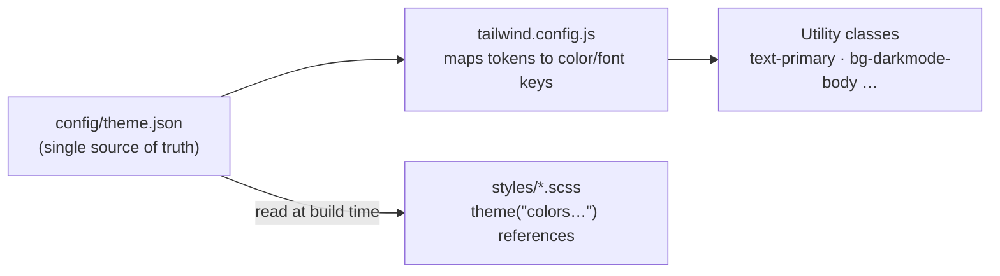
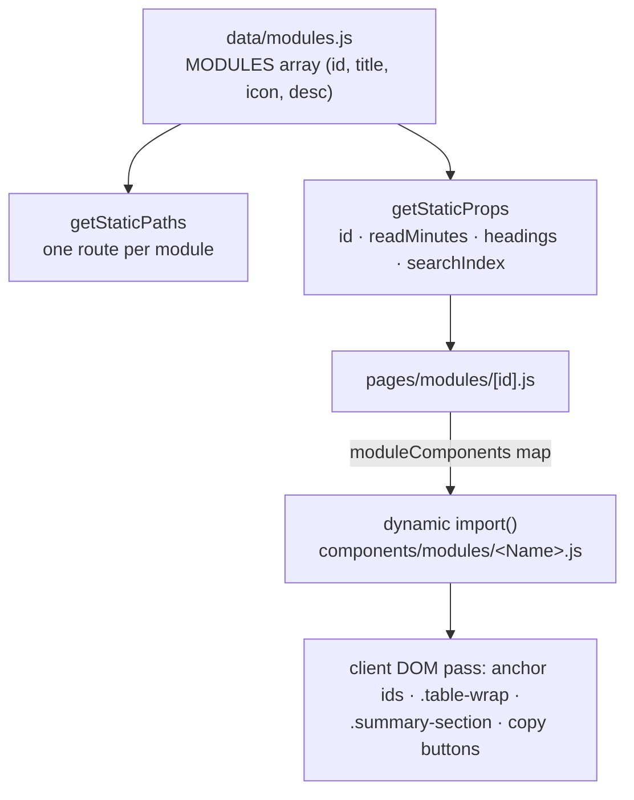
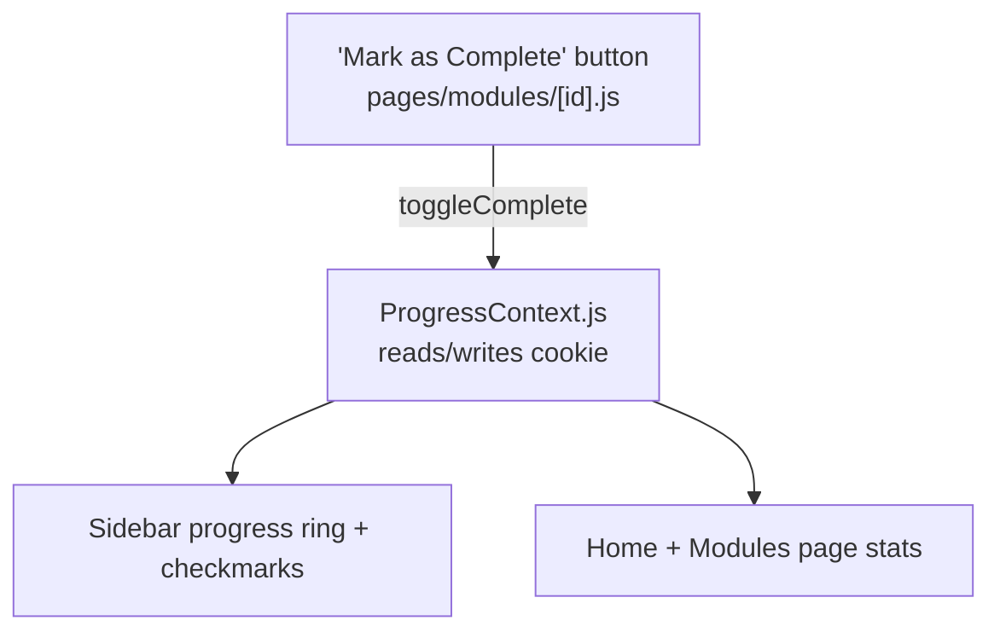
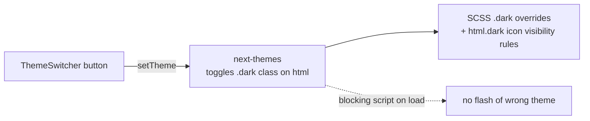

# Data Flow

Four independent flows power the site. None of them touch a server.

## 1. Design Tokens → Styles

Change a value in `theme.json`, rebuild, and every component referencing the token updates. Never hardcode colors in JSX.

## 2. Module Metadata → Pages

Adding a module means touching **three** places — see [Content Guide](content-guide.md).

## 3. Progress Tracking (cookies)

- Storage: a browser cookie holding completed module ids, plus localStorage for the
  module — no accounts, no server.
- Consumers read via `useProgress()` (`completed`, `total`, `isCompleted(id)`,
  `toggleComplete(id)`).

## 4. Theming

Both sun/moon icons render statically; CSS shows the right one for the current class, so there is never a mount flicker.

## Related

- [Architecture](architecture.md) — where these flows live in code
- [Styling & Theming](styling-and-theming.md) — how token styling is authored
