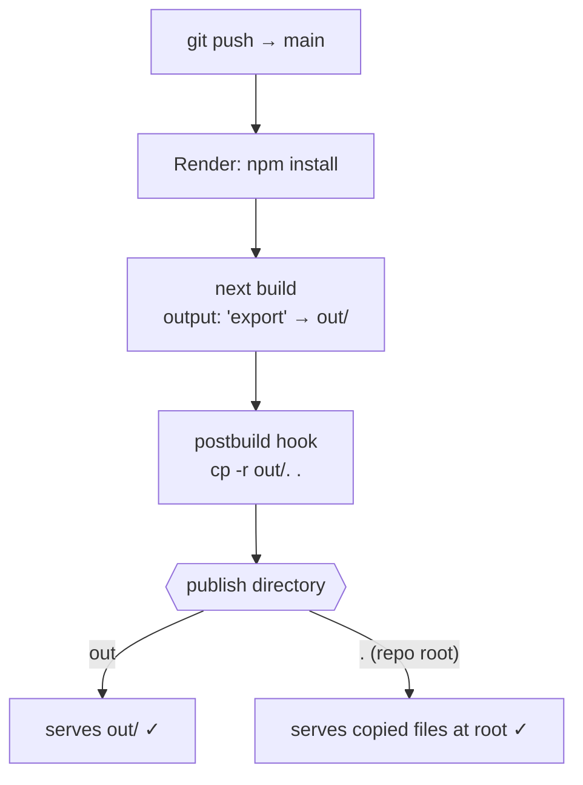

# Deployment

The site is a fully static export hosted on **Render** as a Static Site, auto-deploying on every push to `main`.

## Pipeline



## Why the Copy Hook Exists

Render's publish directory is a **dashboard setting that overrides `render.yaml`**. During initial setup this project hit a case where the dashboard published `.` while builds only produced `out/` — the result: deploys "succeeded" but `https://…onrender.com/` returned a plain-text **Not Found**, with the real site hidden under `/out/`.

The npm lifecycle hooks make every combination work:

```json
"postbuild":        "cp -r out/. .",
"postbuild:render": "cp -r out/. .",
"render:build":     "next build && cp -r out/. ."
```

npm runs these automatically after whichever build script executes — so it does not matter whether Render's Build Command says `build`, `build:render`, or `render:build`.

## Configuration Reference

| Setting | Value | Where |
|---------|-------|-------|
| Type | Static Site | Render dashboard |
| Build Command | `npm install && npm run render:build` | `render.yaml` / dashboard |
| Publish Directory | `out` **or** `.` (both work) | dashboard |
| Auto-deploy | yes, from `main` | dashboard |
| Node version | `>=20.9` via `engines`, pinned 22 by `.node-version` | repo |

`next.config.js` invariants: `output: "export"` always · `trailingSlash: true` (every route gets its own `index.html`) · images unoptimized.

## Troubleshooting Playbook

| Symptom | Diagnosis | Fix |
|---------|-----------|-----|
| Plain-text "Not Found" at `/` | Empty publish directory — nothing built/copied to publish root | Check build command ran a script with the postbuild hook; confirm publish dir is `out` or `.`, not something else |
| Site works at `/out/` but not `/` | Publish dir is `.` and no copy step ran | Update Render to a recent commit containing the postbuild hooks |
| Old content after merge | Deploy failed or auto-deploy disabled | Check Render deploy logs; verify Node ≥ 20.9 was used |
| Build fails on Node error | Next.js 16 requires Node ≥ 20.9 | Ensure `.node-version`/`engines` intact; set `NODE_VERSION` env var if needed |

### Quick live checks

```bash
curl -sI https://<your-site>.onrender.com/            # expect HTTP 200 + text/html
curl -s https://<your-site>.onrender.com/package.json # shows which commit is published
curl -s https://<your-site>.onrender.com/out/index.html | grep -c "<unique-string>"  # UI freshness probe
```
